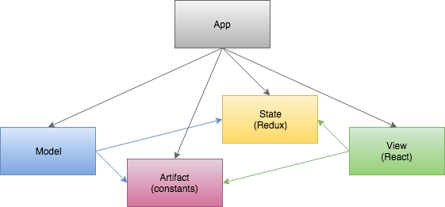

# X-Wing Miniatures Game
Play the game: [X-Wing Miniatures Game](https://cdn.jsdelivr.net/gh/jmthompson2015/xwing-miniatures-1/app/src/XWingMiniaturesApp.html)

## Built With
* [QUnit](https://qunitjs.com/) - JavaScript unit testing.
* [Ramda](https://ramdajs.com) - A practical functional library for JavaScript programmers.
* [React](http://facebook.github.io/react/) - A JavaScript library for building user interfaces.
* [Redux](https://redux.js.org/) - A predictable state container for JavaScript apps.
* [Seamless-Immutable](https://github.com/rtfeldman/seamless-immutable) - Immutable JS data structures which are backwards-compatible with normal Arrays and Objects.
* [Tachyons](http://tachyons.io) - An atomic CSS library.
* [xwing-data](https://github.com/guidokessels/xwing-data/) - An easy-to-use collection of data and images from X-Wing: The Miniatures Game by Fantasy Flight Games.
* [xwing-miniatures-font](https://github.com/geordanr/xwing-miniatures-font) - Vector font for X-Wing: The Miniatures Game by Fantasy Flight Games.

## Architecture

#### Artifact
Contains game data implemented as constant enumerations. (e.g. Ship, PilotCard, UpgradeCard, etc.)

#### State
Provides a serializable game state using Redux.

#### Model
Provides the game rules and processes.

#### View
Provides the GUI components using React.

#### App
Provides integration between the model and the view. Data changes are propagated to the view components, and user actions are transmitted to the model.

#### Accessory
Contains accessory applications.

## License
X-Wing Miniatures Game is released under the terms of the [MIT License](https://github.com/jmthompson2015/xwing-miniatures-game/blob/master/LICENSE).

***
Star Wars, X-Wing: Miniatures Game and all related properties, images and text are owned by Fantasy Flight Games, Lucasfilm Ltd., and/or Disney.
